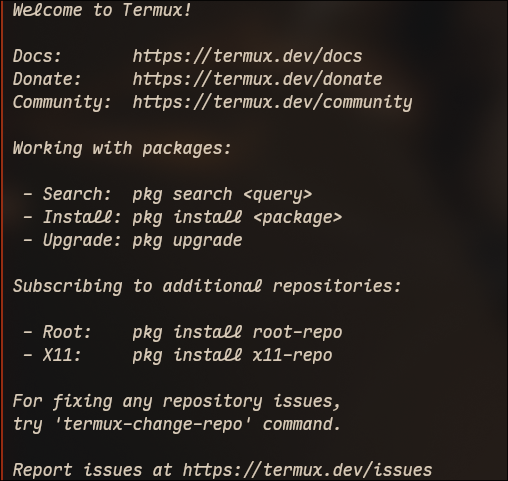

<!--
.. title: connecting to termux on android via ssh
.. slug: ssh-termux
.. date: 2026-07-09 11:14:22 UTC-03:00
.. tags: android, termux, ssh, dropbear
.. category: linux
.. link: https://rodigu.github.io/
.. description: ssh to termux on android
-->

<p align="center">
    
</p>

i have been using [termux](https://termux.dev/en/) on my android phone for a while now. i use it mostly with the [pi](pi.dev) agent and mimo v2.5 to manage my personal finances.

phone screens are not pleasant to type on, so first thing i want to do is ssh into my phone from my laptop.

here is how i did it.

<!-- TEASER_END -->

the termux website has a [tutorial for remote access](https://wiki.termux.com/wiki/Remote_Access) that is very helpful. i wanted to use openssh to connect to my phone, and the process is pretty standard, except for the fact that my android is not rooted, meaning the connection has to be done to port 8022 instead of 22.

for openssh all i had to do was:

1. install it from pkg
    ```bash
    pkg upgrade
    pkg i openssh
    ```

2. run sshd to start the ssh server
    ```bash
    sshd
    ```

3. set password
    ```bash
    passwd
    ```

4. get the phone's ip. use the line with format `xxx.xxx.x.xx` where `x` is a number and the code does not start with `127.x.x.x` (mine looked like `192.xxx.x.xx`)
    ```bash
    ifconfig | grep inet
    ```

5. ssh into it:
    ```bash
    ssh -p 8022 192.xxx.x.x
    ```

however, trying to connect to openssh's `sshd` was getting me a `connection reset by peer` error. it seems it is an [error that sometimes happens with openssh on termux](https://www.reddit.com/r/termux/comments/17x1rvy/ssh_to_termux_keeps_failing/), and the [solution was to use dropbear](https://www.reddit.com/r/termux/comments/17x1rvy/comment/kb6tcup/) instead. they have an [awesome website](https://matt.ucc.asn.au/dropbear/dropbear.html), and a seemingly [solid github](https://github.com/mkj/dropbear), so i figured i'd give it a shot.

after killing `sshd` on termux:

```bash
pkill sshd
```

and installing dropbear:

```bash
pkg i dropbear
```

i added it to [`termux-services`](https://wiki.termux.com/wiki/Termux-services)[^1] to always run:

```bash
sv-enable dropbear
```

and now ssh into my android phone works normally.

i recommend trying openssh before dropbear in any case. for some of my devices openssh works.

[^1]: which i had already installed with `pkd i termux-services`
